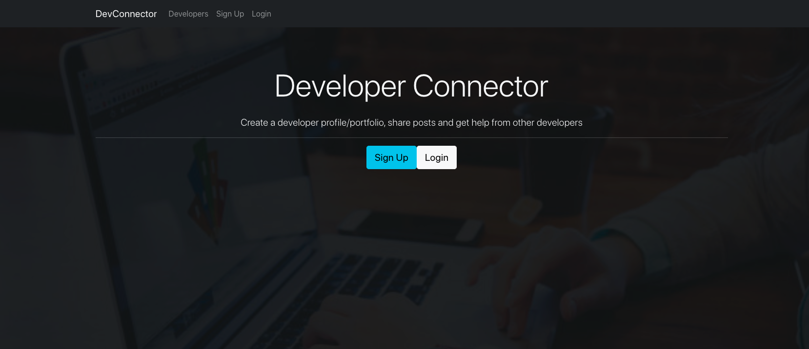

# Dev Connector

Check out Live Site at https://radiant-springs-04144.herokuapp.com/

## Full stack social network application using Node.js, Express, React, Redux and MongoDB

## Tech Used
- Node.js & Express
- Redux for app state management
- ReactJS front end
- Authentication with JWT
- MongoDB 
- GitHub API

## What I learned on this project
- Building an extensive backend API with Node.js & Express
- Protecting routes/endpoints with JWT (JSON Web Tokens)
- Extensive API testing with Postman
- Integrating React with our backend in an elegant way, creating a great workflow
- Building our frontend to work with the API
- Using Redux for app state management
- Creating reducers and actions for our resources
- Creating many container components that integrate with Redux
- Testing with the Redux Chrome extension
