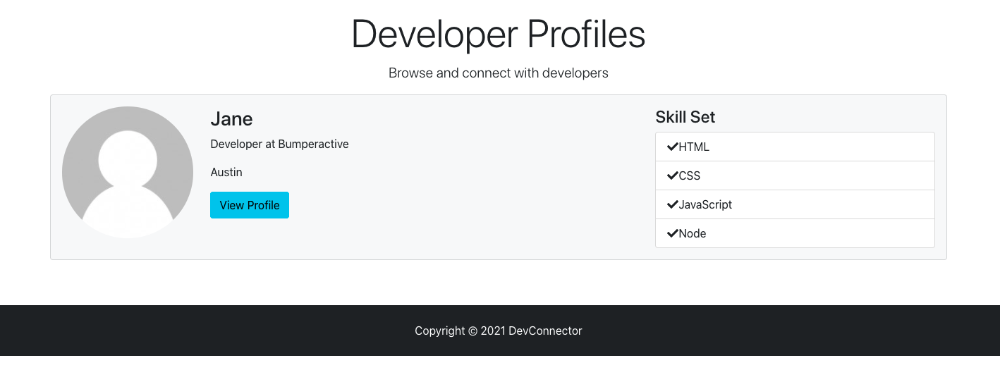
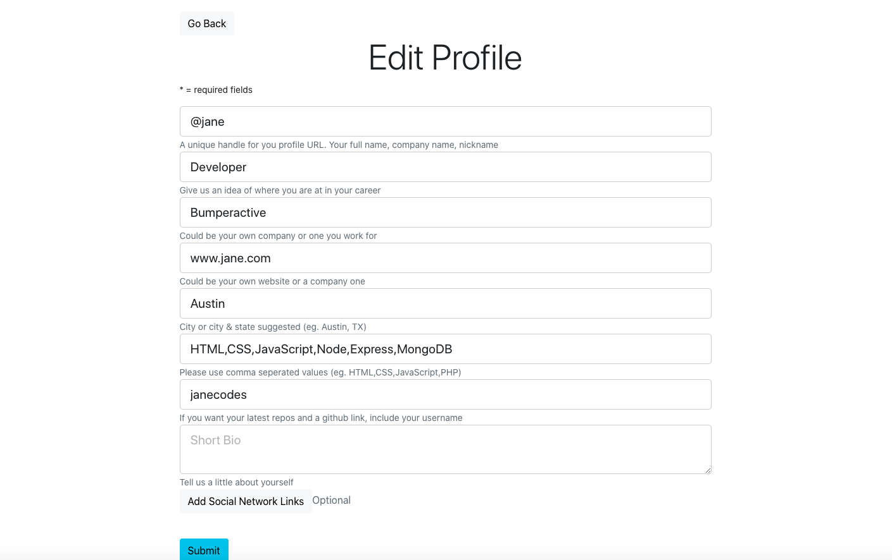
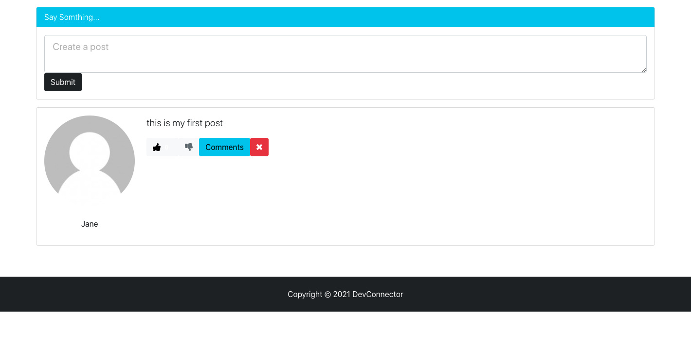

# Dev Connector

Check out Live Site at https://radiant-springs-04144.herokuapp.com/

## Full stack social network application using Node.js, Express, React, Redux and MongoDB

## Tech Used
- Node.js & Express
- Redux for app state management
- ReactJS front end
- Authentication with JWT
- MongoDB 
- GitHub API

## Key Takeaways
- backend API with Node.js & Express
- protected routes/endpoints with JWT (JSON Web Tokens)
- performed API testing with Postman
- integrated React with the backend
- built a frontend to work with the API
- Redux for app state management
- reducers and actions for our resources
- container components that integrated with Redux
